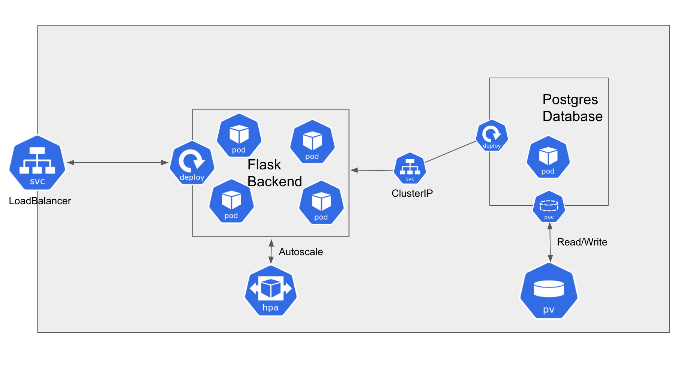

# Kunyk-PMI-34-GusFring

# Getting Started
### Requirements 
* Docker
* Google Kubernetes Engine 

#### 1. If you want just test app go to step 4, else then create your customized docker image from Dockerfile
#### 2. Push it to Dockerhub or any other hub
#### 3. Change image name in flask manifests to this that you created
#### 4. Go to manifests folder and do "kubectl apply -f ..." in order below
* postgres-config.yaml
* postgres-pvc-pv.yaml
* postgres-deployment.yaml
* postgres-service.yaml
* flask-deployment.yaml
* flask-service.yaml
* flask-hpa.yaml (optional if you not interested in auto-scaling)

### App architecture 

